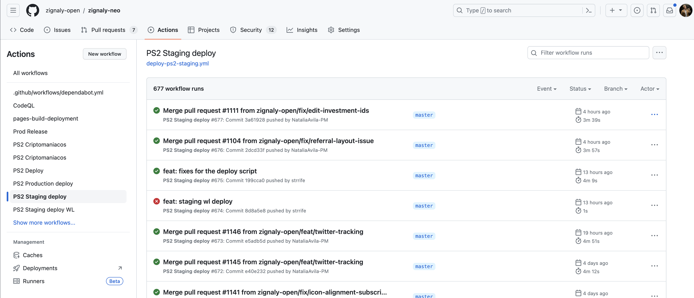

# Deploy to env

OK, you gotta deploy. Like, ASAP. Ideally yesterday. [Twice](https://www.urbandictionary.com/define.php?term=2%20of%20%27em%20Yesterday).

### How to trigger a Prod deploy

1. Create a Github release with a proper tag
2. Publish the release
3. You are done.

What's the proper tag? It's `release-ps2-*`, i.e. `release-ps2-got-myself-a-911-turbo-s` to deploy ALL PS2 envs. So, our [PS2 app](https://app.zignaly.com) and all the whitelabels which are deployed through us). 

### How to trigger a Staging deploy

1. Push to `master`
2. You are done.

Yes, that simple.

### How to re-deploy

Find the proper deploy action [here](https://github.com/zignaly-open/zignaly-neo/actions) (for example, this is the [staging deploy](https://github.com/zignaly-open/zignaly-neo/actions/workflows/deploy-ps2-staging.yml)).

Yes, we may or may not have waited to have the PR #1111 merged to have the nice number here. Now click the deploy you'd like to re-run. In the top right corner you will ahve the "Re-run all jobs" button. 

Done.
