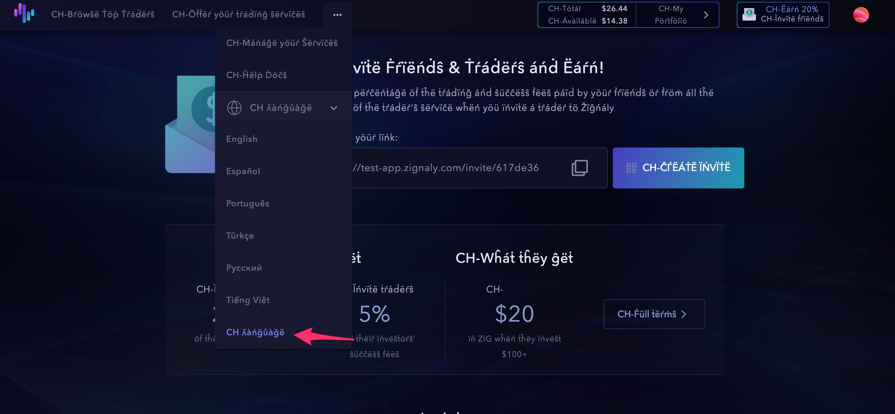

# Multilanguage

Our current application support multiple languages besides English as Turkish or Spanish among others.

The procedure is the following:
1. All literals must be added to the language file English.

```
packages/ps2/public/locales/en/*.json
```

2. Automatically on deploy translations are included in a QA file for translations named CH. This allow us to check in the interface that literals are ready to be translated.



3. Then from Lokalize we translate to different languages. 
4. Once translations are finished in Lokalize we create pull requests with new languages files.


